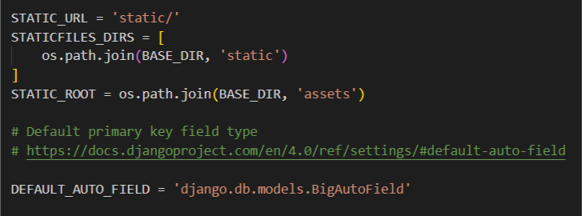
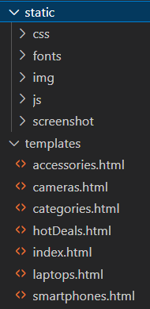
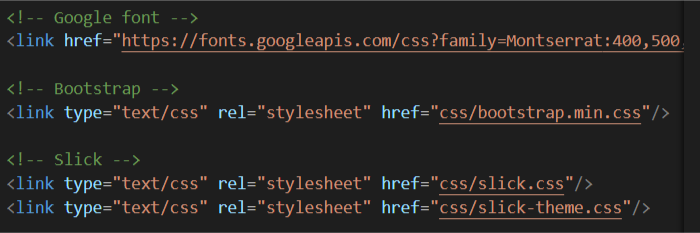

<table>
    <theader>
        <tr>
            <td style="width:25%;"></td>
            <td>
                UNIVERSIDAD NACIONAL DE SAN AGUSTIN 
                FACULTAD DE INGENIERÍA DE PRODUCCIÓN Y SERVICIOS 
                DEPARTAMENTO ACADÉMICO DE INGENIERÍA DE SISTEMAS E INFORMÁTICA 
                ESCUELA PROFESIONAL DE INGENIERÍA DE SISTEMAS
            </td>            
        </tr>
    </theader>
    <tbody>
        <tr>
        <td colspan="2">Proyecto web: Desarrollo de una pagina web para la venta de electrónica</td>
        </tr>
        <tr>
        <td colspan="2">Fecha:  2022/08/22</td>
        </tr>
    </tbody>
</table>

PROYECTO WEB 

<table>
<theader>
<tr><th>INFORMACIÓN BÁSICA</th></tr>
</theader>
<tbody>
    <tr>
        <td>ASIGNATURA:</td><td>Programación Web 2</td>
    </tr>
    <tr>
        <td>SEMESTRE:</td><td>III</td>
    </tr>
    <tr>
        <td>FECHA INICIO:</td><td>30-May-2022</td><td>FECHA FIN:</td>
        <td>23-Ago-2022</td><td>DURACIÓN:</td><td>04 horas</td>
    </tr>
    <tr>
        <td colspan="3">INTEGRANTES:
        <ul>
        <li>Hurtado Bejarano Michael Steve</li>
        </ul>
        </td>
    </<tr>
    <tr>
        <td colspan="3">DOCENTES:
        <ul>
        <li>Richart Smith Escobedo Quispe - rescobedoq@unsa.edu.pe</li>
        </ul>
        </td>
    </<tr>
</tdbody>
</table>

#   WebApp con Django

[![License][license]][license-file]
[![Downloads][downloads]][releases]
[![Last Commit][last-commit]][releases]

[![Debian][Debian]][debian-site]
[![Git][Git]][git-site]
[![GitHub][GitHub]][github-site]
[![Vim][Vim]][vim-site]
[![Java][Java]][java-site]

##  Tipo de Sistema
    Se trata de un sistema web de venta de productos electrónicos (laptops, celulares, audifonos, etc.)

##  Requisitos del sistema
    El sistema debe satisfacer los siguientes requisitos funcionales y no funcionales:

    - RQ01 : Disponible a traves de un link url
    - RQ02 : Debe tener un menu de categorias de cada uno de los diferentes productos
    - RQ03 : Vista perzonalizada para cada uno de los productos que se seleccionaran
    - RQ04 : Posibilidad de añadirlos a un carrito de compras
    - RQ05 : Perzonalización de la compra
    - RQ06 : Ingresar datos para realizar una compra en caso no se haya registrado
    - RQ07 : Permitir seleccionar un metodo de pago

##  Modelo de datos
    El modelo de datos estaria conformado por 
    - Sin iniciar sesion:
        Categorias: 
        Se dividirian cada uno de los diferentes productos de acuerdo a características similares (telefono, laptop)
        Modelo:
        El modelo del cual está fabricado el producto
        Precio: 
        El valor que va a tener y pagará el comprador
    - Iniciando sesión:
        Usuario:
        A partir de la sesion iniciado en un usuario, sigue las categorias y marcas(perzonalizadas para para uno)
    El modelo de datos esta conformado por las siguientes entidades.

##  Diccionario de datos

    En la construcción de software y en el diccionario de datos sobre todo se recomienda y se utilizará el idioma inglés para especificar objetos, atributos, etc.

| Usuario | | | | | |
| -- | -- | -- | -- | -- | -- |
| Atributo  | Tipo  | Nulo | Clave | Predeterminado | Descripción |
| user  | cadena| No | Si | username## | nombre |
...

| Marca | | | | | |
| -- | -- | -- | -- | -- | -- |
| Atributo  | Tipo  | Nulo | Clave | Descripción |
| LG  | cadena| No | Si | nombre |
| Samsung  | cadena| No | Si | nombre |
...

| Precio | | | | | |
| -- | -- | -- | -- | -- | -- |
| Atributo  | Tipo  | Nulo | Clave | Descripción |
| Price | numerico| No | Si | valor |
...

##  Diagrama Entidad-Relación
    ...

##  Administración con Django
    Se muestran los pasos realizados para crear el Proyecto, la aplicación, creacion de modelos, migraciones y habilitación del panel de administración en Django.
    ...

##  Plantillas Bootstrap
    Se seleccionó la siguiente plantilla para el usuario final (No administrador).

    Demo online:
    URL: https://themewagon.com/themes/free-bootstrap-ecommerce-template-electro/

    Se muestran las actividades realizadas para adecuación de plantillas, vistas, formularios en Django.

    - Se edita el settings.py del proyecto para reconocer los css, html y js de la plantilla
    </img>

    - Se crean la carpeta templates donde estarán los html y la carpeta static para los archivos estáticos 
    </img>

    - Finalmente se cambia el directo del cual los html obtendrán sus características (la carpeta static creada y dentro las carpetas ya sean css, js, etc).
    </img>

##  CRUD - Core Business - Clientes finales
    

##  Servicios mediante una API RESTful
    Se ha creado una aplicación que pondra a disposición cierta información para ser consumida por otros clientes HTTP.
    1. GET : Con el método get se devolverá la lista de cursos, grupos y horarios establecidos para que el alumno sobre todo vea esta información en cualquier otro medio. En formato JSON. 
    2. POST : Con este método se enviara el código del alumno y se devolvera sus inscripciones. En formato JSON.

Github del proyecto: https://github.com/Eduard1610/Proyecto-PW2_Sistema-Web.git

URL en Heroku: https://sistema-web-1.herokuapp.com/

URL Playlist YouTube.
Producción de un PlayList en Youtube explicando cada una de los requerimientos.

## REFERENCIAS
-   

#

[license]: https://img.shields.io/github/license/rescobedoq/pw2?label=rescobedoq
[license-file]: https://github.com/rescobedoq/pw2/blob/main/LICENSE

[downloads]: https://img.shields.io/github/downloads/rescobedoq/pw2/total?label=Downloads
[releases]: https://github.com/rescobedoq/pw2/releases/

[last-commit]: https://img.shields.io/github/last-commit/rescobedoq/pw2?label=Last%20Commit

[Debian]: https://img.shields.io/badge/Debian-D70A53?style=for-the-badge&logo=debian&logoColor=white
[debian-site]: https://www.debian.org/index.es.html

[Git]: https://img.shields.io/badge/git-%23F05033.svg?style=for-the-badge&logo=git&logoColor=white
[git-site]: https://git-scm.com/

[GitHub]: https://img.shields.io/badge/github-%23121011.svg?style=for-the-badge&logo=github&logoColor=white
[github-site]: https://github.com/

[Vim]: https://img.shields.io/badge/VIM-%2311AB00.svg?style=for-the-badge&logo=vim&logoColor=white
[vim-site]: https://www.vim.org/

[Java]: https://img.shields.io/badge/java-%23ED8B00.svg?style=for-the-badge&logo=java&logoColor=white
[java-site]: https://docs.oracle.com/javase/tutorial/

[![Debian][Debian]][debian-site]
[![Git][Git]][git-site]
[![GitHub][GitHub]][github-site]
[![Vim][Vim]][vim-site]
[![Java][Java]][java-site]

[![License][license]][license-file]
[![Downloads][downloads]][releases]
[![Last Commit][last-commit]][releases]
